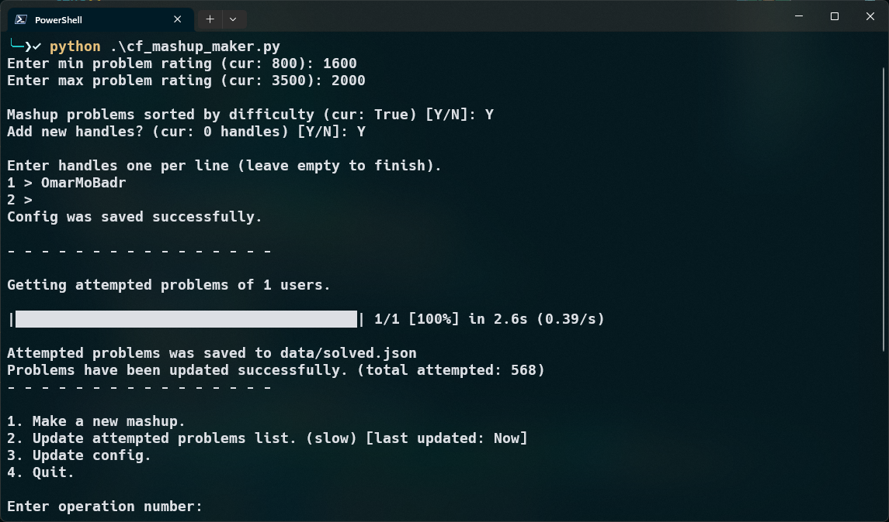
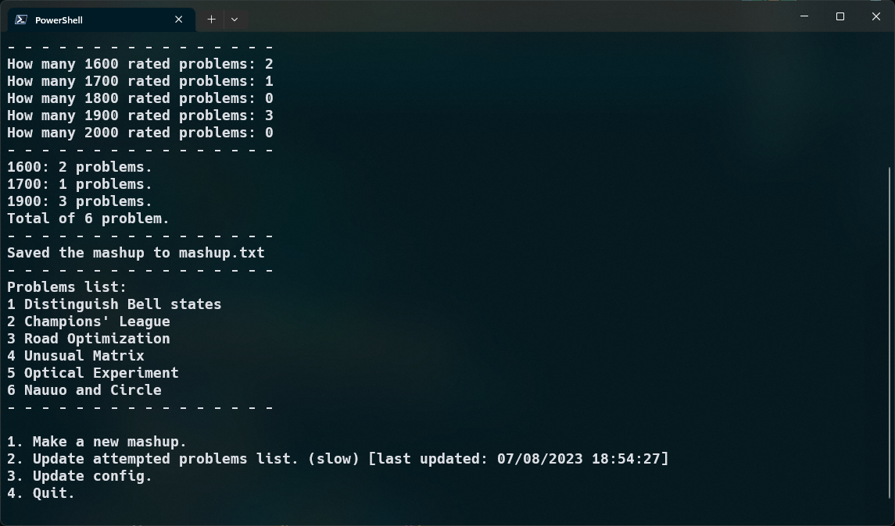

# Codeforces Mashup Maker

cf_mashup_maker, a simple tool written in Python that helps pick random **unattempted** problems for a Codeforces training mashup.

## Screenshots





## Features

- Add users' handles to exclude all their attempted problems.
- Specify how many problems you want per rating.
- Saves the handles to be used later.
- No need to fetch the attempted problems list every time.

## Getting Started

Download and extract the repo or clone it using.

```
git clone https://github.com/OmarMoBadr/CF-Mashup-Maker.git
```

cd into the repo.

```
cd CF-Mashup-Maker
```

Install the required modules.

```
pip install -r requirements.txt
```

run the tool.

```
python cf_mashup_maker.py
```

## Usage

Follow the instructions to configure the script:

- `min problem rating` min problem rating option when making the mashup.
- `max problem rating` max problem rating option when making the mashup.
- `problems sorted by difficulty` sorted in the output file.

After that, you can add users' handles to exclude all their attempted problems.

Wait for the attempted problems list to be fetched (it may take several seconds).

Make a new mashup by specifying how many problems per rating.

Now a `mashup.txt` file has been made containing the codes for the mashup problems (make a contest using them).

## Dependencies

CodeforcesApiPy: https://pypi.org/project/CodeforcesApiPy/ <br />
Alive Progress: https://pypi.org/project/alive-progress/ <br />
